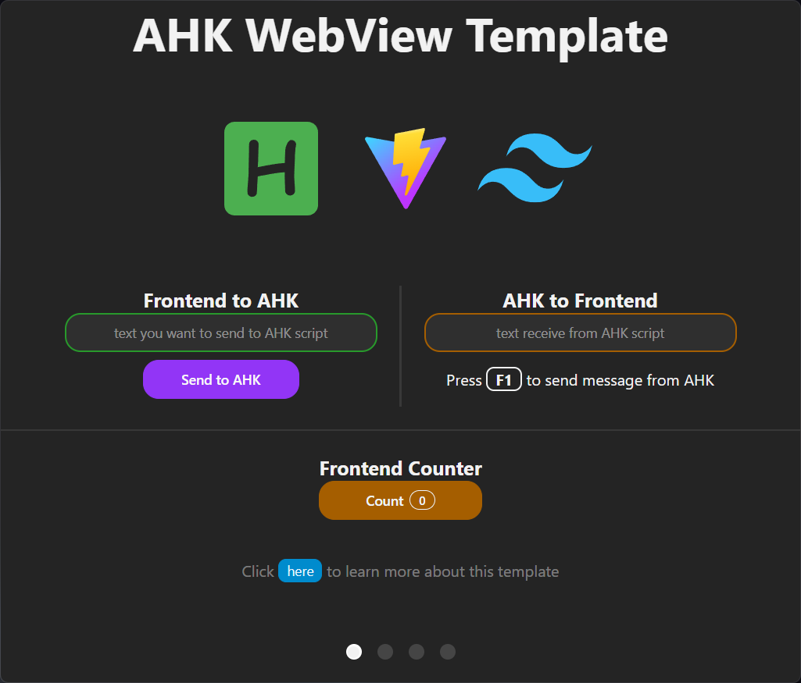
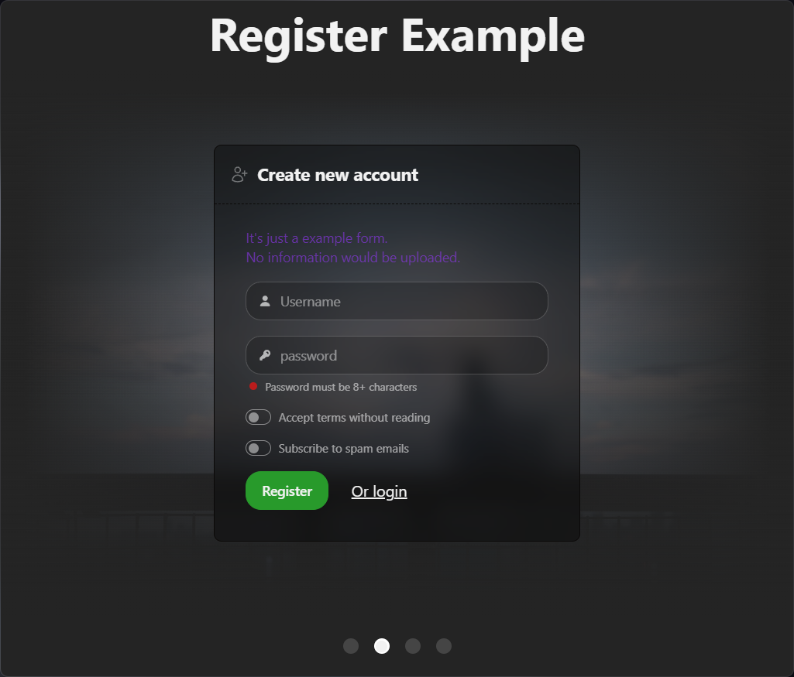
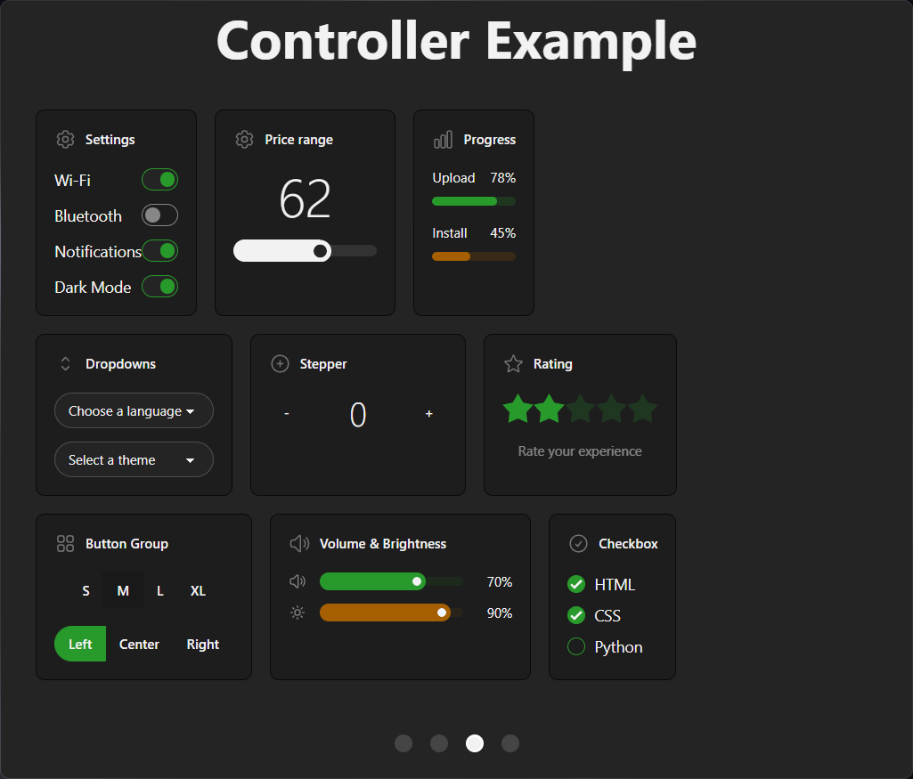
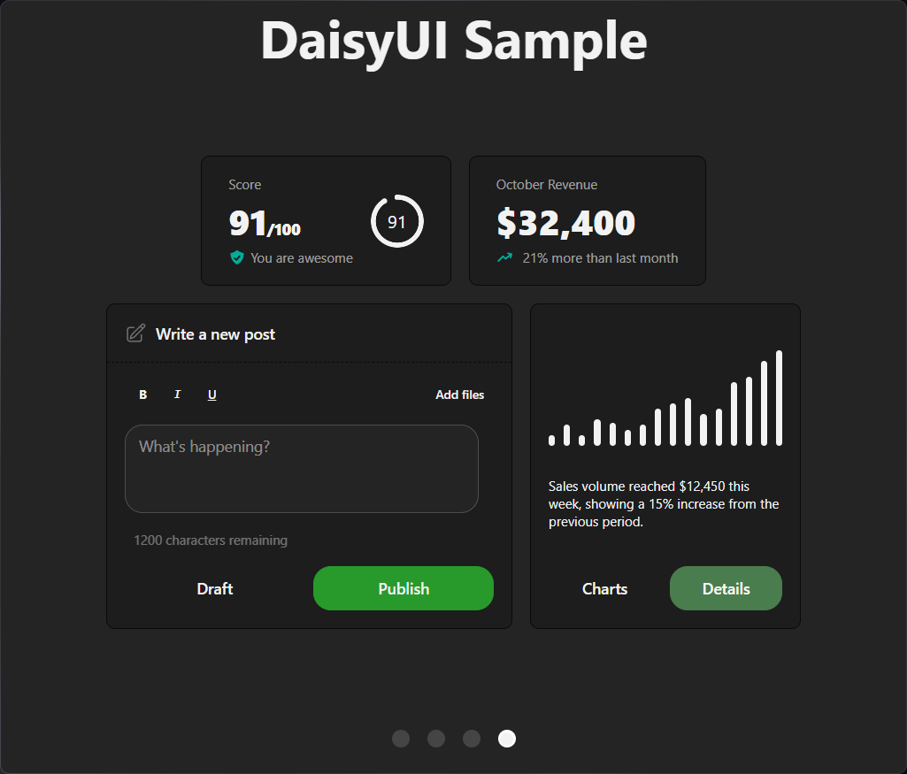

# AHK WebView Template

A desktop application template that combines **AutoHotkey v2** with a modern web frontend built on **Vite**, **TailwindCSS v4**, and **DaisyUI v5**. Uses [WebViewToo](https://github.com/The-CoDingman/WebViewToo) to render a web-based GUI inside an AHK window, with bidirectional message passing between the AHK script and the web frontend.

[简体中文](README_cn.md)

## Features

- **Hot-reload development** — Frontend changes reflect instantly; press `F6` to reload the AHK script
- **Bidirectional messaging** — Send JSON messages between AHK and the web frontend
- **Modern frontend** — Vite 7 + TailwindCSS v4 + DaisyUI v5 with component-based HTML architecture
- **Custom window chrome** — Frameless window with drag-to-move support
- **One-command build** — `npm run build` compiles both frontend and AHK into a standalone `.exe`
- **4 demo pages** — Message passing, form controls, UI widgets, and DaisyUI component samples

## Demo Pages

| Page | Description |
|---|---|
| **AHK WebView Template** | Bidirectional message demo — send strings from frontend to AHK (`Msgbox`), and from AHK to frontend via hotkey `F1`. Includes a frontend-only counter. |
| **Register Example** | Form UI demonstrating DaisyUI form components with a background image. |
| **Controller Example** | Interactive UI controls: toggles, range sliders, progress bars, dropdowns, stepper, rating, button groups, volume/brightness sliders, checkboxes. |
| **DaisyUI Sample** | Stat cards, a post editor with formatting toolbar, and a bar chart. |

Navigate between pages by scrolling or clicking the pagination dots at the bottom.

<p align="center">


</p>

<p align="center">


</p>

## Tech Stack

| Layer | Technology |
|---|---|
| Desktop wrapper | [AutoHotkey v2](https://www.autohotkey.com/) (64-bit) + [WebViewToo](https://github.com/The-CoDingman/WebViewToo) |
| Build tool | [Vite 7](https://vitejs.dev/) |
| CSS framework | [TailwindCSS v4](https://tailwindcss.com/) + [DaisyUI v5](https://daisyui.com/) |
| HTML components | [vite-plugin-html-inject](https://github.com/alextsagkas/vite-plugin-html-inject) |
| AHK toolchain | [ahk64](https://www.npmjs.com/package/ahk64) (npm CLI for running/compiling AHK) |

## Project Structure

```
ahk-webview-template/
├── frontend/
│   ├── index.html                 # Entry point — loads components via <load> tags
│   ├── src/
│   │   ├── app.css                # TailwindCSS v4 + DaisyUI v5 custom dark theme
│   │   ├── main.js                # Page navigation + AHK message handler
│   │   ├── counter.js             # Frontend-only counter component
│   │   └── stepper.js             # Stepper control logic
│   ├── components/                # HTML partials loaded via <load src="...">
│   │   ├── title.html             #   Title bar with drag-to-move
│   │   ├── logos.html             #   Logo display
│   │   ├── front2ahk.html         #   Frontend → AHK message demo
│   │   ├── ahk2front.html         #   AHK → Frontend message demo
│   │   ├── counter.html           #   Click counter
│   │   ├── register.html          #   Registration form
│   │   ├── toggle.html            #   Toggle switches
│   │   ├── range.html             #   Range slider
│   │   ├── progress.html          #   Progress bars
│   │   ├── select.html            #   Dropdown selects
│   │   ├── stepper.html           #   Numeric stepper
│   │   ├── rating.html            #   Star rating
│   │   ├── btnGroup.html          #   Button groups
│   │   ├── volumes.html           #   Volume & brightness sliders
│   │   ├── checkbox.html          #   Checkboxes
│   │   ├── score.html             #   Stat card (score)
│   │   ├── score2.html            #   Stat card (revenue)
│   │   ├── post.html              #   Post editor
│   │   ├── chart.html             #   Bar chart
│   │   └── footer.html            #   Page footer
│   └── public/assets/             # Static assets (images, fonts)
├── scripts/
│   └── dev.js                     # Dev orchestrator — runs Vite + AHK concurrently
├── webview/                       # WebViewToo library (third-party, do not modify)
│   ├── WebViewToo.ahk
│   ├── WebView2.ahk
│   ├── ComVar.ahk
│   ├── Promise.ahk
│   └── 64bit/                     # WebView2 loader DLL
├── app.ahk                        # AHK entry point — creates WebViewGui, registers callbacks
├── gen_resource.ahk               # Generates resource.ahk with embedded dist/ assets
├── vite.config.js                 # Vite config (root: frontend/, output: dist/)
├── package.json
└── README.md
```

## Getting Started

### Prerequisites

- **Node.js** (LTS) — [nodejs.org](https://nodejs.org/)
- **AutoHotkey v2** (64-bit) — [autohotkey.com](https://www.autohotkey.com/)

### Installation

```sh
npm install
```

### Development

Start the dev server (Vite + AHK running concurrently):

```sh
npm run dev
```

- Frontend hot-reloads on file changes
- Press `F6` to reload the AHK script
- Press `Ctrl+C` to exit

For auto-reload on AHK file changes:

```sh
npm run dev:watch
```

### Build

Compile the frontend and AHK script into a standalone executable:

```sh
npm run build
```

Run the compiled binary:

```sh
npm run preview
```

## Architecture

### AHK ↔ Frontend Communication

The AHK script and web frontend communicate via JSON messages:

**Frontend → AHK:**
```js
window.chrome.webview.postMessage(JSON.stringify({ type: "Msg", content: "hello" }))
```

**AHK → Frontend:**
```ahk
MyGui.PostWebMessageAsJson('{"type":"testMsg","content":"hello"}')
```

**Registering AHK callbacks:**
```ahk
MyGui.AddCallbackToScript("Msg", WebviewMsg)
```

### Component System

HTML partials in `frontend/components/` are injected into `index.html` using the `<load>` tag:

```html
<load src="./components/counter.html" />
```

Each component is a self-contained HTML fragment that can include its own `<script>` tags.

### Dev vs Compiled Mode

| Mode | Frontend source | AHK navigation |
|---|---|---|
| Development | Vite dev server (`http://localhost:5173`) | `MyGui.Navigate("http://localhost:5173")` |
| Compiled | Embedded resources in `dist/` | `MyGui.Navigate("index.html")` |

The `gen_resource.ahk` script generates `resource.ahk` which embeds all `dist/` files into the compiled AHK binary.

## Available Scripts

| Command | Description |
|---|---|
| `npm run dev` | Start development mode (Vite + AHK) |
| `npm run dev:watch` | Dev mode with AHK file watching |
| `npm run build` | Build frontend + compile AHK to `.exe` |
| `npm run build:front` | Build frontend only |
| `npm run build:ahk` | Compile AHK only |
| `npm run preview` | Run compiled `app.exe` |

## License

[MIT](LICENSE)
