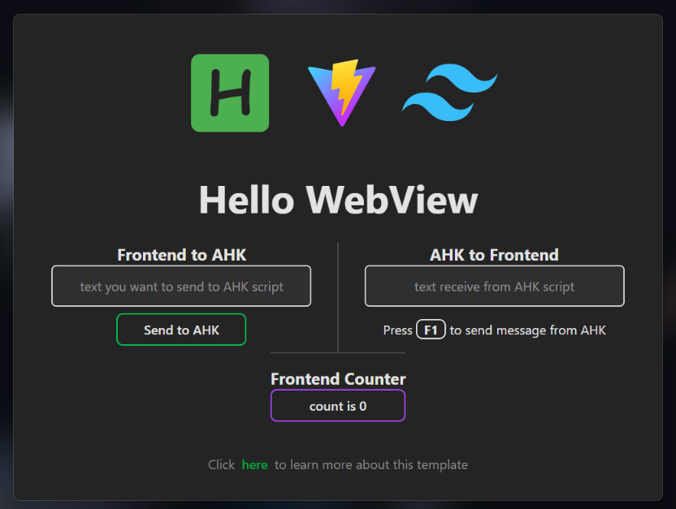

# AHK Webview Template (WIP)

[English](README.md)

一个基于 **vite** + **tailwindcss** 的 **AutoHotkey** WebView 模板。

> [!WARNING]
> 本项目正处在开发的早期阶段，各种特性与表现都可能发生变化。

> [!NOTE]
> 该模板使用了 [**WebViewToo**](https://github.com/The-CoDingman/WebViewToo) 作为 webview 包装器。

## 简介



这个模板使用 [**WebViewToo**](https://github.com/The-CoDingman/WebViewToo) 作为 webview 包装器，并结合 vite 构建了一个支持前端热重载的 AHK WebView GUI 开发框架。在这个框架下，你可以使用各种现代前端技术为你的 AHK 应用创建惊艳的图形界面与交互。

在模板的界面上，点击 `Hello WebView` 标题即可拖动整个窗体。

左边的输入框是一个示例，展示了如何从前端向 AHK 脚本发送消息。在输入框中输入任意字符串并点击发送，AHK 脚本将使用 `Msgbox` 方法打印出该字符串。

右边的输入框是一个示例，展示了如何从 AHK 脚本向前端发送消息。按下热键 `F1`，AHK 脚本将循环发送几个预设的字符串至前端。

下方是一个完全在前端构建的计数器，不与 AHK 脚本交互。

## 项目结构

```
.
├── frontend
│   ├── public
│   │   └── assets
│   ├── src
│   │   ├── counter.js
│   │   ├── main.js
│   │   └── style.css
│   └── index.html		; 前端入口
├── scripts
│   └── dev.js
├── webview				; WebViewToo 库
├── .gitignore
├── app.ahk				; AHK 入口
├── LICENSE
├── package-lock.json
├── package.json
├── README.md
├── resource.ahk
├── Screenshot.png
└── vite.config.js
```

## 准备

由于本模板需要使用前端技术栈来构建应用的 GUI，因此使用 `npm` 来管理项目的依赖和构建过程。

在 Windows 上安装 NPM 的步骤：

1. 访问 [nodejs.org](https://nodejs.org/)
2. 下载适用于 Windows 的 **LTS** 版本
3. 选择 64 位版本，因为模板仅支持 64 位
4. 运行安装程序以安装 Node.js 和 NPM
5. 安装完成后，打开 **PowerShell**，运行 `node --version` 和 `npm --version` 来验证安装是否成功。

## 使用方法

首先，安装依赖：

```sh
npm install
```

然后，使用以下命令进入开发模式：

```sh
npm run dev
```

在开发模式下，前端的修改会即时更新。更新 AHK 脚本后，按下热键 `F6` 重载脚本。

或者，你也可以使用以下命令进入监控模式，当 AHK 脚本发生变化时自动重载（这种方式较少使用）：

```sh
npm run dev:watch
```

在开发模式下，按 `Ctrl+C` 可以结束开发模式。

最后，使用以下命令编译二进制文件：

```sh
npm run build
```

使用以下命令可以运行编译出的二进制文件，或者你也可以手动运行：

```sh
npm run preview
```
